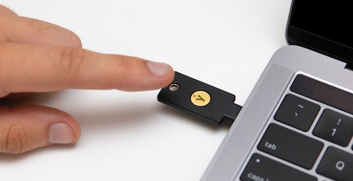

Security Framework
==================

:Версия: v1.0

Все мы начинали с того, что нам особо нечего было защищать в онлайне, но со
временем ценности появились, а старые привычки не замечать проблемы безопасности
остались, так как безопасность часто идёт вразрез удобству, и проще же вообще
ничего не менять. Поэтому особое внимание тут будет уделено удобству.

Существует огромное множество статей о том, как решить одну определённую задачу,
но нет готового комплексного решения, чтобы покрыть большинство проблем.
Поэтому данный проект называется фреймворком, этот проект не предлагает выбор,
он предлагает конкретные решения. Поэтому никаких "если" и никаких "или". Этот
фреймворк можно использовать как пошаговую инструкцию к применению.

.. contents::
  Содержание:

Нам понадобится
~~~~~~~~~~~~~~~

- `Google Authenticator`_ - бесплатный аутентификатор для телефона
- `1Password`_ - менеджер паролей, $2.99 в месяц
- `YubiKey 5-series`_ - аппаратный ключ безопасности, требуется два таких,
  от $45 каждый

Что такое YubiKey?

  Source https://itsfoss.com/yubikey-5c-nfc/

Это аппаратный ключ безопасности от компании Yubico. В первую
очередь он предназначен для двухфакторной аутентификации которая предельно
толерантна к фишингу. Чтобы вы понимали насколько это крутое устройство, сразу
скажу что мы будем генерировать приватный SSH ключ прямо внутри YubiKey, этот
приватный ключ там и будет храниться всё время, и никак его оттуда прочитать
или скопировать физически невозможно, а чтобы воспользоваться этим SSH ключом
вам понадобится сам аппаратный ключ и знание PIN кода, который защищен от
перебора самим ключом.

YubiKey - это не единственный вариант подобных ключей, есть ещё Titan от Google,
Thesis и несколько других производителей. Все они реализуют открытые стандарты,
поэтому они взаимозаменяемые. Разница в том, какой функционал они предоставляют
и какие стандарты поддерживают. Для двухфакторной аутентификации актуальным
стандартом является FIDO2. YubiKey дополнительно поддерживает ещё стандарты
PIV и OpenPGP. Нам интересен стандарт PIV, работа с ним будет описана далее.
Стоит ещё заметить что у YubiKey нет внутри батареек и движущихся частей, их
конструкция максимально надёжна и долговечна.

У компании Yubico есть очень много вариантов ключей, можно запутаться.
Актуальными являются ключи 5-й серии, можно сказать что они умеют всё. Но, если
вам ключ нужен только для двухфакторной аутентификации, то можно сэкономить
и приобрести ключи `YubiKey Security Key`_ (с поддержкой FIDO2 стандарта).

Аппаратных ключа безопасности надо два, как и в случае с ключами от машины
всегда должен быть второй запасной ключ. Потерять ключ безопасности можно вместе
с телефоном, и тогда вам точно понадобится запасной второй ключ безопасности.

Пример. У меня ноутбук только с USB-C портами и есть переходник на USB-A, а
также стационарный компьютер со всеми возможными портами. Я выбрал себе
`YubiKey 5C NFC`_ как основной и `YubiKey 5 NFC`_ как запасной ключ.

Общая картина
~~~~~~~~~~~~~

Полезно визуально представлять себе такую иерархию, в которой видно на чём
основана безопасность каждого из сервисов. Чем проще эта конфигурация - тем
лучше.

.. code-block:: text

  YubiKey && Authenticator
  ├─ 1Password
  │  ├─ Apple
  │  ├─ Google
  │  ├─ Bank
  │  └─ ...
  └─ SSH
     └─ Git

В данной конфигурации вся наша безопасность основана на аппаратных ключах
YubiKey и на приложении-аутентификаторе. А также на нас самих: мы отвечаем
за то, что ответственно храним пароли в своей памяти. Если на данном уровне
что-то не так, то и всё остальное будет под сомнением.

Пароли
~~~~~~

Не существует одного простого правила по составлению паролей. Правила меняются
в зависимости от задачи. Основные критерии:

- надо ли пароль запомнить
- есть ли защита от перебора паролей

Самое главное: пароли не должны повторяться и не должно быть возможности
их подобрать зная что-то о вас, например, вашу дату рождения, ваших
родственников и друзей, ваши увлечения.

Master пароль к менеджеру паролей
---------------------------------

Принято считать, что пароли из букв, цифр и символов - это самые сильные пароли.
На самом деле эти требования часто приводят к плохим паролям, люди плохо умеют
придумывать случайные пароли, т.к. их трудно запомнить.

На сайте 1Password есть много информации на эту тему:

- https://blog.1password.com/how-long-should-my-passwords-be/
- https://support.1password.com/strong-master-password/

Если коротко, выбирайте для Master пароля значение из нескольких слов, например:

.. code-block:: text

  glazing-quetzal-big-bold-pullback

Данный пароль был сгенерирован тут:
https://1password.com/password-generator/?type=memorable.
Его легко запомнить, легко произносить, легко вводить слепым набором на
клавиатуре. И главное он на множество порядков сложнее для перебора чем ваш
текущий пароль из букв, цифр и специальных символов.

Пароль к телефону и к компьютеру
--------------------------------

Современные телефоны и компьютеры Apple снабжены аппаратным хранилищем
персональной информации (Secure Enclave), это хранилище не даст возможности
перебирать ваш пароль сколько угодно раз. Но к составлению хорошего пароля всё
равно следует отнестись очень серьёзно.

Например, мало кто осознаёт что Apple позволяет совершать некоторые действия
связанные с вашим Apple ID не спрашивая при этом пароль от Apple ID,
достаточно будет ввести пароль от телефона/компьютера. Таким образом плохой
пароль от телефона/компьютера сведёт на нет хороший пароль от Apple ID.

Самое главное чтобы пароль был случайным и уникальным, этот пароль не должен
использоваться где-то ещё.

- для пароля от компьютера можно воспользоваться тем же методом, что и для
  Master пароля от менеджера паролей
- для пароля от телефона желательно воспользоваться генератором паролей

Мало кто знает, но на iPhone можно установить любой пароль, а не только пароль
из 6 цифр. Тем самым можно ещё больше обезопасить ваш телефон. Но это уже за
гранью удобства.

2FA или MFA
~~~~~~~~~~~

Телефонный номер
----------------

Скорее всего у вас уже был настроен номер вашего телефона как второй фактор
аутентификации на некоторых сервисах. После настройки приложения-аутентификатора
и двух аппаратных YubiKey ключей, телефонный номер как второй фактор
аутентификации стоит отключить. Иначе это станет самым слабым звеном, которое
сведёт на нет пользу от аппаратных ключей безопасности.

В данный момент Apple ID для двухфакторной аутентификации поддерживает только
номера телефона и доверенные устройства. Это пока особый случай.

Аутентификатор
--------------

Приложение-аутентификатор по уровню безопасности хуже чем аппаратные
ключи безопасности, оно не предотвращает фишинговые атаки, поэтому пользоваться
им в ежедневной практике не стоит. Нам аутентификатор нужен как ещё один
вид второго фактора для большей избыточности, и многие сервисы потребуют у вас
сначала зарегистрировать аутентификатор как второй фактор, и только потом
появится возможность зарегистрировать ваши ключи безопасности. Так в нашей
конфигурации будет 3 вида второго фактора аутентификации: одно
приложение-аутентификатор и два аппаратных ключа безопасности.

Второй фактор должен быть физически изолирован от первого фактора - пары
логин-пароль, не передаваться по сети, быть физически в единственном экземпляре
и на одном устройстве. Ваше физическое устройство - телефон - это и есть ваш
второй фактор, а приложение-аутентификатор - это лишь деталь реализации.

Многие дополнительные функции у приложений-аутентификаторов созданы
по причине того, что эти приложения являются единственным вторым фактором для
многих пользователей, и терять его нежелательно. Но к нам это не относится, нам
не страшно потерять телефон, мы к этому готовимся. И поэтому нам нужен
максимально простой и безопасный аутентификатор.

`Google Authenticator`_ - это как раз максимально простой и безопасный
аутентификатор, в котором нет ни одной лишней функции. Бэкапы, например, там
отсутствуют by design, так безопаснее.

**Важно** безопасно включать двухфакторную аутентификацию. Нежелательно включать
двухфакторную аутентификацию только с одним видом второго фактора. Например, вы
уже скачали себе приложение-аутентификатор, но заказанные аппаратные ключи вы
ещё не получили. В таком случае лучше подождать пока вы получите ключи
безопасности, и только потом настраивать двухфакторную аутентификацию сразу на
три вида второго фактора. Приложение-аутентификатор - это всего лишь приложение,
его можно случайно удалить, внутри приложения можно случайно удалить данные
какого-то сервиса, приложение может перестать корректно работать после
обновления операционной системы телефона, телефон может прийти в негодность по
самым разным причинам и его опят же можно потерять.

YubiKey FIDO2
-------------

FIDO2 - это новый стандарт, который призван окончательно решить проблему с
фишингом. В ходе реализации этого стандарта появился W3C стандарт WebAuthn и
наконец-то весь пазл сошелся. Именно благодаря WebAuthn у нас появляется
возможность пользоваться аппаратным ключом безопасности практически в любом
браузере и на любой платформе.

Ничего настраивать в телефоне и на компьютере обычно не надо, всё должно
работать из коробки:

- вставляете ключ в компьютер
- регистрируете его в учётной записи сервиса
- при входе в сервис:

  * на телефоне прикладываете ключ к телефону (NFC)
  * на компьютере требуется прикоснуться пальцем к ключу (ключ в USB разъёме)

Аппаратные ключи безопасности могут работать со следующими интерфейсами:

- USB (в том числе и через Lightning разъём)
- NFC
- BLE (Bluetooth)

SSH и Git
~~~~~~~~~

Обычно приватные ключи у людей хранятся на диске, к ним имеет доступ сам
пользователь системы и root. Дополнительно можно зашифровать ключ и доступ к
ключу будет только через пароль. Ещё можно зашифровать диск, и загрузить систему
можно будет тоже только через пароль.

Минусы:

- доступ к приватному ключу всё ещё теоретически возможен, его можно легко
  скопировать, привилегированного доступа к системе (sudo) для этого не нужно
- пароль к приватному ключу можно подобрать методом перебора
- шифрование диска не даёт 100% гарантии того, что данные нельзя будет
  прочитать, есть успешные примеры атак, где получалось получить доступ к данным
  на компьютере с аппаратным шифрованием данных на диске

YubiKey PIV
-----------

Наиболее безопасным способом будет использование аппаратных ключей
безопасности. Приватный ключ можно сгенерировать прямо внутри YubiKey
средствами самого ключа, откуда его уже будет невозможно физически прочитать.
Чтобы воспользоваться этим приватным ключом вам понадобится физический доступ к
ключу и ввод PIN кода ключа. Можно ещё настроить так, чтобы ключ требовал
дополнительно физическое прикосновение пальцем. В отличие от пароля к SSH ключу,
у вас будет всего 3 попытки ввести PIN код, после чего ключ будет заблокирован,
т.е. подобрать PIN код методом перебора невозможно, за это отвечает сам
аппаратный ключ, а не какая-то программа на вашем компьютере.

YubiKey для SSH доступа поддерживает два стандарта: OpenPGP и PIV. Первый
стандарт подразумевает использование GnuPG, что сложно, ещё раз сложно и может
привести к ошибкам. PIV стандарт - это стандарт для смарт-карт, разработанный
NIST для использования в гос. органах США. Оба эти стандарта позволяют
использовать YubiKey и для аутентификации, и для шифрования, и для подписывания
данных. Мы будем использовать простой и понятный PIV стандарт.

Настройка PIV
-------------

Для работы с ключами нам потребуется консольная программа `YubiKey Manager`_:

.. code-block:: console

  $ brew install ykman
  $ ykman --version
  YubiKey Manager (ykman) version: 3.1.1
  Libraries:
      libykpers 1.20.0
      libusb 1.0.23

Вставляем ключ в USB разъём и проверяем:

.. code-block:: console

  $ ykman info
  Device type: YubiKey 5C NFC
  Serial number: XXXXXXXX
  Firmware version: 5.2.7
  Form factor: Keychain (USB-C)
  Enabled USB interfaces: OTP+FIDO+CCID
  NFC interface is enabled.

  Applications  USB     NFC
  OTP           Enabled Enabled
  FIDO U2F      Enabled Enabled
  OpenPGP       Enabled Enabled
  PIV           Enabled Enabled
  OATH          Enabled Enabled
  FIDO2         Enabled Enabled

Для начала нам понадобится сменить заводские коды ключа: PIN, PUK и Management
Key. Все коды мы будем генерировать случайным образом и хранить в менеджере
паролей, это нормально так как:

- доступ к менеджеру паролей возможен и в офлайне
- для доступа к менеджеру паролей на новом устройстве мы можем воспользоваться
  всё тем же YubiKey ключом как вторым фактором аутентификации и PIN код для
  этого не требуется, PIN код нужен только для PIV функционала

Так что хранить коды в менеджере паролей - это довольно практично и безопасно,
всё остаётся под контролем. Со временем PIN код мы будем знать наизусть,
остальными кодами мы будем пользоваться сильно реже.

После 3-х неудачных попыток ввести неправильный PIN код PIV функционал будет
заблокирован, потребуется PUK код для сброса PIN кода.

После 3-х неудачных попыток ввести неправильный PUK код PIV функционал будет
окончательно заблокирован и потребуется сделать сброс всего PIV функционал до
заводских настроек. Все данные в PIV функционале будут потеряны, надо будет
заново произвести данную настройку ключа. Остальная часть ключа никак не
пострадает.

Подробности:

- https://developers.yubico.com/PIV/Guides/Device_setup.html
- https://developers.yubico.com/yubikey-piv-manager/PIN_and_Management_Key.html

PIN код
+++++++

YubiKey поддерживает от 6 до 8 цифро-буквенных символов, но для совместимости
с другими системами рекомендуется использовать только цифры. Генерируем
случайные 6 цифр в менеджере паролей и меняем PIN код:

.. code-block:: console

  $ ykman piv change-pin --pin 123456
                               ^^^^^^- текущий заводской PIN код
  Enter your new PIN:
  Repeat for confirmation:
  New PIN set.

PUK код
+++++++

Те же условия что и для PIN кода. Генерируем случайные 8 цифр в менеджере
паролей и меняем PUK код:

.. code-block:: console

  $ ykman piv change-puk --puk 12345678
                               ^^^^^^^^- текущий заводской PUK код
  Enter your new PUK:
  Repeat for confirmation:
  New PUK set.

Management Key
++++++++++++++

Этот код имеет размер 24 байта, в отличие от PIN и PUK кодов, этот код не
защищен от перебора ключей, поэтому тут особо важно сгенерировать код случайным
образом, YubiKey Manager умеет сам это делать:

.. code-block:: console

  $ ykman piv change-management-key --generate
  Enter PIN:
  Generated management key: 010203040506070801020304050607080102030405060708
                            ^^^^^^^^^^^^^^^^^^^^^^^^^^^^^^^^^^^^^^^^^^^^^^^^

Сохраняем сгенерированный ключ управления в менеджер паролей.

Генерация SSH ключа
-------------------

.. code-block:: console

  $ ykman piv info
  PIV version: 5.2.7
  PIN tries remaining: 3
  CHUID:  **********
  CCC:    **********

YubiKey имеет множество слотов для хранения ключей, вот тут их полный список:
https://developers.yubico.com/PIV/Introduction/Certificate_slots.html

Для аутентификации предназначен слот ``9a``:

.. code-block:: console

  $ ykman piv generate-key --algorithm ECCP384 9a public.pem
  Enter a management key [blank to use default key]:

PIV стандарт пока не поддерживает ключи RSA размером более 2048, вместо этого
есть ECCP256 и ECCP384 - аналоги по сложности RSA 3072 и RSA 7680
соответственно, по мнению NSA.

Генерируем сертификат и импортируем его обратно в ключ:

.. code-block:: console

  $ ykman piv generate-certificate -s "/CN=SSH key/" 9a public.pem
  Enter PIN:
  Enter a management key [blank to use default key]:

После генерации и импорта сертификата в ключ про файл ``public.pem`` можете не
переживать и удалить его, он нам больше не понадобится, его всегда можно будет
достать обратно из ключа.

Проверяем:

.. code-block:: console

  $ ykman piv info
  PIV version: 5.2.7
  PIN tries remaining: 3
  CHUID:  **********
  CCC:    **********
  Slot 9a:
          Algorithm:      ECCP384
          Subject DN:     CN=/CN=SSH key/
          Issuer DN:      CN=/CN=SSH key/
          Serial:         **********
          Fingerprint:    **********
          Not before:     2020-01-01 23:59:59
          Not after:      2021-01-01 23:59:59

Время действия сертификата на SSH доступ не влияет.

Настройка SSH клиента
---------------------

Взаимодействие сторонних систем с аппаратными ключами происходит по специальному
API, описанному в стандарте PKCS#11. Есть две актуальные реализации этого API:
проект OpenSC_ и разработанная компанией Yubico библиотека ``ykcs11``, мы будем
использовать второй вариант, который идёт в комплекте с `Yubico PIV-Tool`_:

.. code-block:: console

  $ brew install yubico-piv-tool
  $ yubico-piv-tool --version
  yubico-piv-tool 2.1.1
  $ ls -l /usr/local/lib/libykcs11.dylib
  lrwxr-xr-x  1 user  admin  51 Oct 14 14:27 /usr/local/lib/libykcs11.dylib -> ../Cellar/yubico-piv-tool/2.1.1/lib/libykcs11.dylib

Проверяем видит ли SSH наши ключи:

.. code-block:: console

  $ ssh -V
  OpenSSH_8.4p1, OpenSSL 1.1.1h  22 Sep 2020
  $ ssh-keygen -D /usr/local/lib/libykcs11.dylib -e
  ecdsa-sha2-nistp384 ********** Public key for PIV Authentication
  ssh-rsa ********** Public key for PIV Attestation

В списке должно быть два ключа:

- ``ecdsa-sha2-nistp384`` - это сгенерированный нами ключ в слоте ``9a``
- ``ssh-rsa`` - это ключ слота ``f9``, который предназначен для аттестации, он
  там находится с завода, с его помощью можно убедиться в том, что ключи во всех
  остальных слотах были сгенерированы безопасно внутри аппаратного ключа,
  а не были импортированы в аппаратный ключ извне

Если вы тут видите только ключ аттестации, то скорее всего ваша версия OpenSSH
не поддерживает ключи ECCP384. Тут либо прийдётся использовать RSA2048 ключи,
либо обновить версию OpenSSH:

.. code-block:: console

  $ brew install openssh

Если SSH корректно считывает наш ключ, то можно скопировать строчку
``ecdsa-sha2-nistp384 **********`` в настройки GitHub и в настройки SSH сервера
- файл ``~/.ssh/authorized_keys``.

Для того чтобы ``ssh`` работал с нашим аппаратным ключом, минимальный конфиг
SSH клиента должен выглядеть так:

.. code-block:: console

  $ cat ~/.ssh/config
  Host *
    PKCS11Provider /usr/local/lib/libykcs11.dylib

Проверяем:

.. code-block:: console

  $ curl https://github.com/vmagamedov.keys
  ecdsa-sha2-nistp384 **********
  $ ssh -T git@github.com
  Enter PIN for 'YubiKey PIV #XXXXXXXX':
  Hi vmagamedov! You've successfully authenticated, but GitHub does not provide shell access.

SSH агент
---------

TL;DR: Пользоваться SSH агентом совместно с аппаратными ключами безопасности
не рекомендуется.

Возможно вы ранее уже пользовались SSH агентом, чтобы каждый раз не вводить
слово-пароль к приватному ключу. SSH агент также умеет работать с провайдером
PKCS#11:

.. code-block:: console

  $ eval "$(ssh-agent -P '/usr/lib/*,/usr/local/lib/*,/usr/local/Cellar/yubico-piv-tool/*')"
  Agent pid 78254
  $ ssh-add -s /usr/local/Cellar/yubico-piv-tool/2.1.1/lib/libykcs11.dylib
  Enter passphrase for PKCS#11:
  Card added: /usr/local/Cellar/yubico-piv-tool/2.1.1/lib/libykcs11.dylib
  $ ssh-add -L
  ecdsa-sha2-nistp384 ********** Public key for PIV Authentication
  ssh-rsa ********** Public key for PIV Attestation

В Linux всё должно быть немного проще, если ``libykcs11`` будет установлена
в ``/usr/lib`` или ``/usr/local/lib`` - по-умолчанию SSH агент разрешает
подгружать библиотеки только из этих мест.

Но опять же пользоваться SSH агентом не рекомендуется:

- недопонимание того как работает SSH агент может само по себе создать
  уязвимость
- SSH агент наиболее актуален когда у вас SSH ключи со сложными паролями; но
  когда у вас аппаратный ключ с простым для запоминания и ввода PIN кодом,
  который защищён от перебора, то необходимость в агенте практически отпадает

Когда надо создать SSH соединение через bastion/jumpbox сервер,
то ``ForwardAgent`` считается плохой практикой, существует более безопасная
альтернатива - ``ProxyJump``. Так что от SSH агента пользы мало, а рисков много.

Данные на диске
~~~~~~~~~~~~~~~

Если у вас Mac с чипом T2, то ваш диск шифруется автоматически, даже если
выключен FileVault. Ключ шифрования хранится внутри чипа T2 и без именно этого
чипа расшифровать диск невозможно. Но всё равно следует включить FileVault,
никого влияния на скорость работы вашего компьютера это не создаст.

Если FileVault выключен, то при запуске системы диск будет автоматически
разблокирован, диск будет расшифровываться автоматически на аппаратном уровне,
операционная система загрузится, без пароля вы не зайдёте в систему, однако
есть вероятность воспользоваться уязвимостями системы и всё же прочитать данные
с разблокированного диска.

Если FileVault включен, то операционная система даже не начнёт свою загрузку
пока вы не введёте пароль, это самый безопасный способ, защита на аппаратном
уровне. Шифрование на аппаратном уровне также исключает возможность перебора
паролей, защита от перебора реализуется чипом T2, а не операционной системой.

Software способы шифрования требуют сложного пароля, иначе пароль можно
будет подобрать методом перебора. Хранить такой пароль в менеджере паролей
не получится, т.к. пароль нужно ввести ещё до загрузки операционной системы.
Поэтому аппаратные способы шифрования имеют значимое преимущество.

Подробности:
https://www.apple.com/euro/mac/shared/docs/Apple_T2_Security_Chip_Overview.pdf

Дополнительные материалы
~~~~~~~~~~~~~~~~~~~~~~~~

- https://github.com/drduh/YubiKey-Guide
- https://github.com/drduh/macOS-Security-and-Privacy-Guide

История изменений
~~~~~~~~~~~~~~~~~

- **v1.0** Первоначальная версия

.. _Google Authenticator: https://apps.apple.com/us/app/google-authenticator/id388497605
.. _1Password: https://1password.com
.. _YubiKey 5-series: https://www.yubico.com/products/yubikey-5-overview/
.. _YubiKey 5 NFC: https://www.yubico.com/product/yubikey-5-nfc/
.. _YubiKey 5C NFC: https://www.yubico.com/product/yubikey-5c-nfc/
.. _YubiKey Security Key: https://www.yubico.com/product/security-key-nfc-by-yubico/
.. _YubiKey Manager: https://developers.yubico.com/yubikey-manager/
.. _Yubico PIV-Tool: https://developers.yubico.com/yubico-piv-tool/
.. _OpenSC: https://github.com/OpenSC/OpenSC
